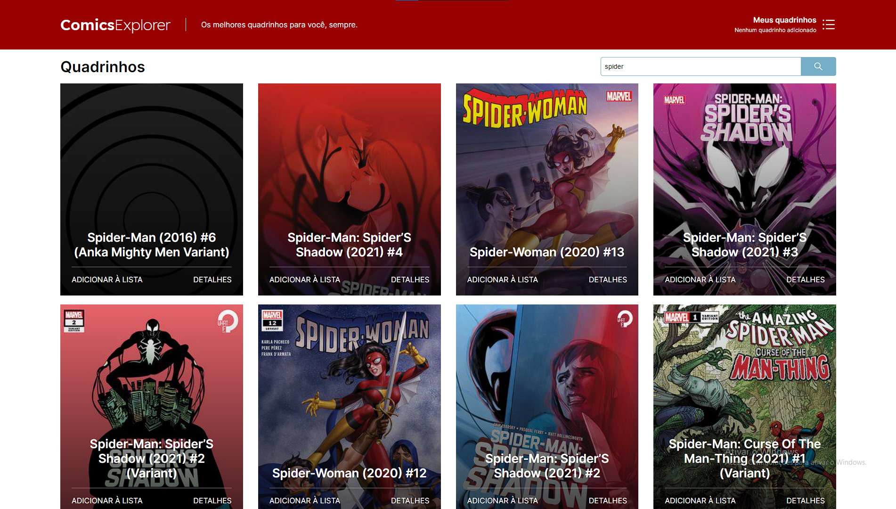
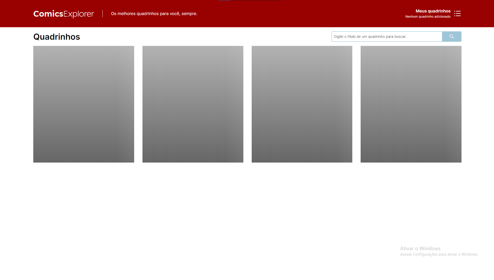
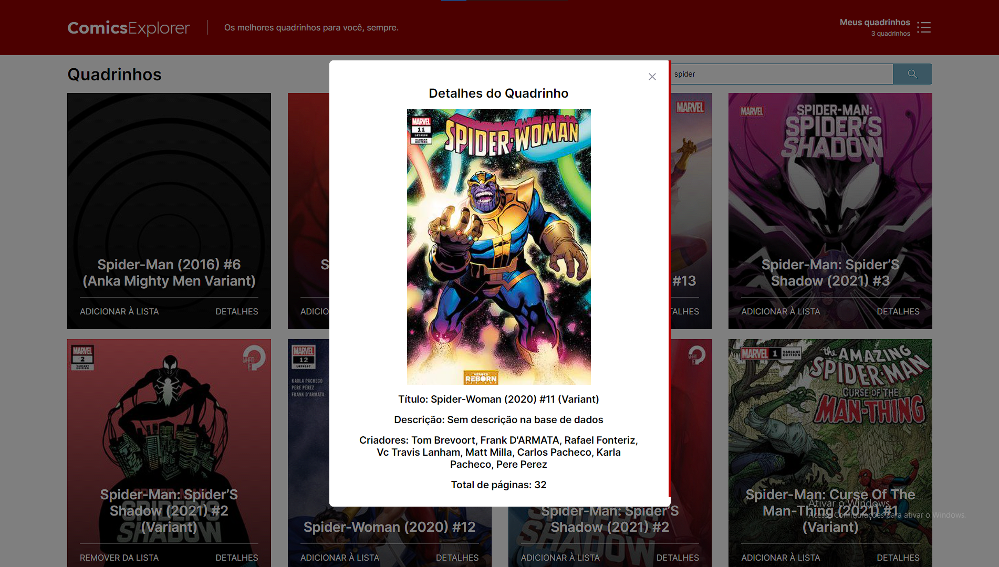
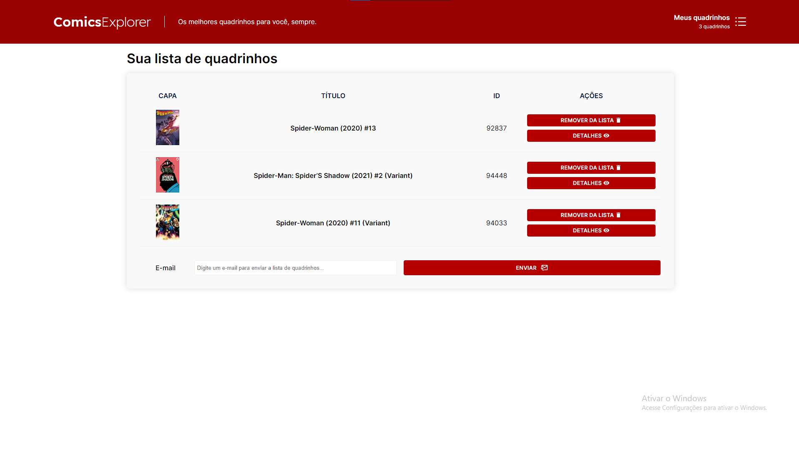
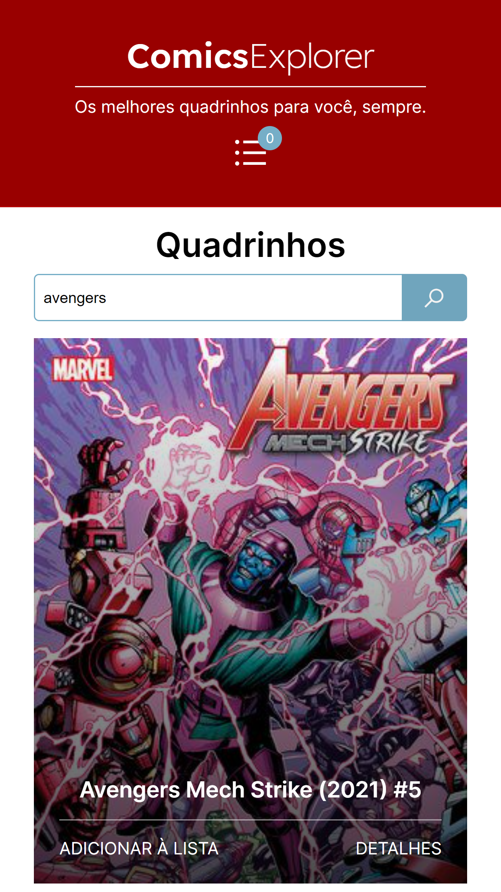
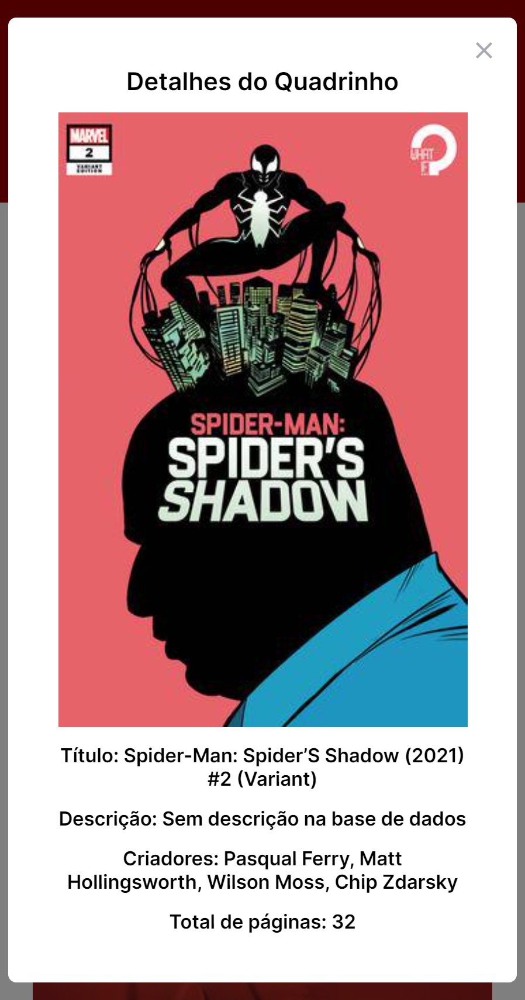
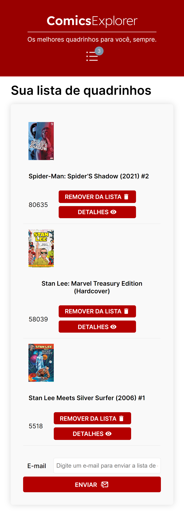
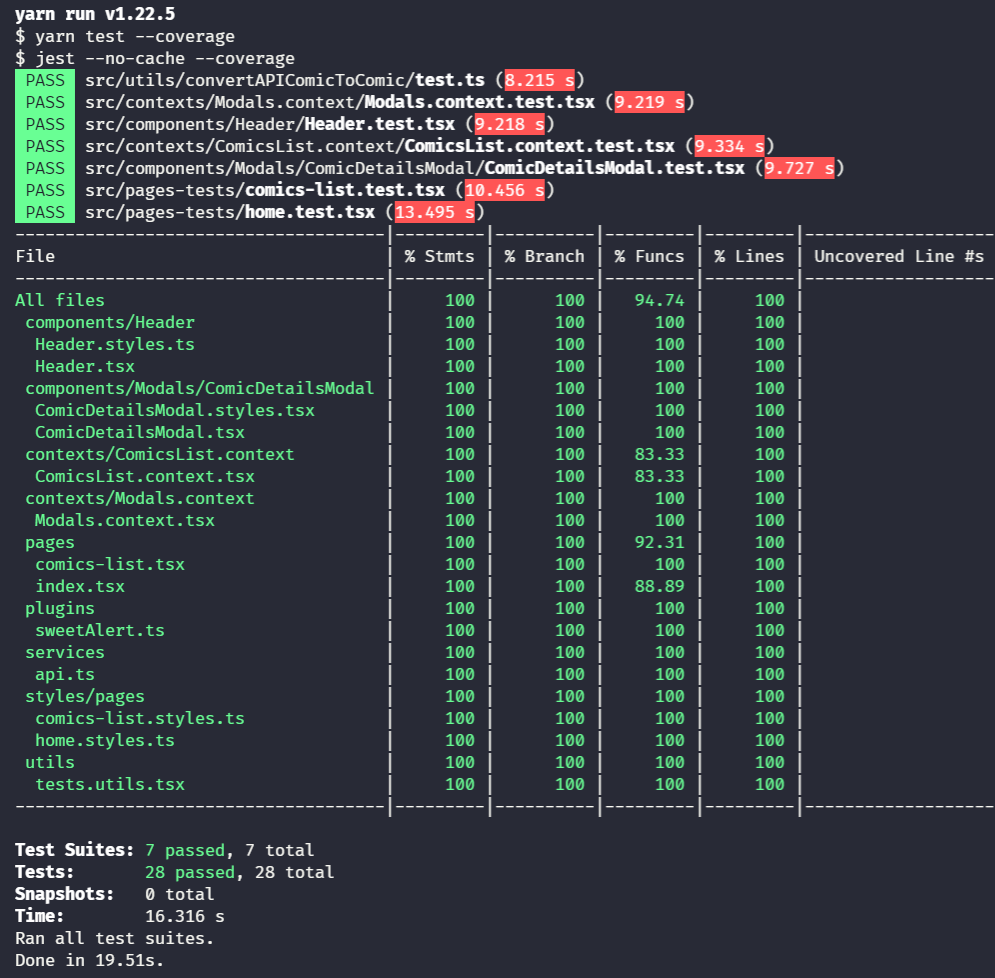
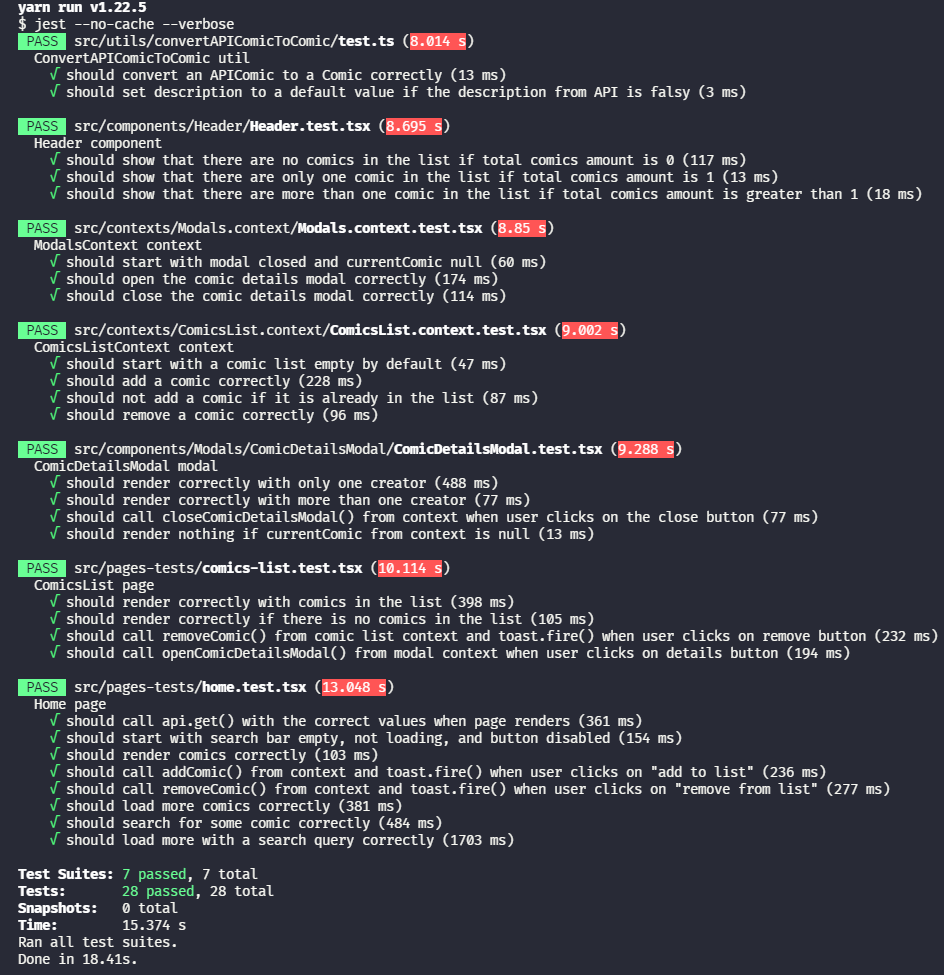

<h1 align="center">
  :superhero_man: ComicsExplorer :closed_book:
</h1>

<h4 align="center">
  Um desafio front-end desenvolvido por <a href='https://github.com/TiagoDiass'>@TiagoDiass</a> onde pessoas podem procurar por livros usando a API da Marvel
</h4>

<p align="center">
  
</p>

<p align="center">
  <a href="#final-result">Resultado final</a>&nbsp;&nbsp;&nbsp;|&nbsp;&nbsp;&nbsp;
  <a href="#features">Funcionalidades</a>&nbsp;&nbsp;&nbsp;|&nbsp;&nbsp;&nbsp;
  <a href="#tests">Testes</a>&nbsp;&nbsp;&nbsp;|&nbsp;&nbsp;&nbsp;
  <a href="#technologies">Tecnologias utilizadas</a>&nbsp;&nbsp;&nbsp;|&nbsp;&nbsp;&nbsp;
  <a href="#deploy">Deploy</a>&nbsp;&nbsp;&nbsp;|&nbsp;&nbsp;&nbsp;
  <a href="#how-to-run">Como rodar</a>
</p>

&nbsp;&nbsp;&nbsp;&nbsp;&nbsp;&nbsp;&nbsp;&nbsp;&nbsp;
&nbsp;&nbsp;&nbsp;&nbsp;&nbsp;&nbsp;&nbsp;&nbsp;&nbsp;
&nbsp;&nbsp;&nbsp;&nbsp;&nbsp;&nbsp;&nbsp;&nbsp;&nbsp;
&nbsp;&nbsp;&nbsp;&nbsp;&nbsp;&nbsp;&nbsp;&nbsp;&nbsp;
&nbsp;&nbsp;&nbsp;&nbsp;

<h2 align="center">
  <a href="https://south-frontend-challenge.vercel.app/" target="_blank">
    Demo na Vercel
  </a>
</h2>

<h2 id="final-result" name="final-result">
  :clipboard: Resultado final
</h2>

### [Clique aqui para ver o projeto rodando na Vercel](https://south-frontend-challenge.vercel.app/)

### Desktop preview
<div>
  <strong>Home</strong> <br>
  
  <hr>
  
  <strong>Shimmer effect</strong> <br>
  
  <hr>
  
  <strong>Modal de detalhes</strong> <br>
  
  <hr>
  
  <strong>Lista de quadrinhos</strong> <br>
  
  <hr>
</div>

### Mobile preview
<div>
  <strong>Home</strong> <br>
  
  <hr>
  
  <strong>Shimmer effect</strong> <br>
  
  <hr>
  
  <strong>Modal de detalhes</strong> <br>
  
  <hr>
  
  <strong>Lista de quadrinhos</strong> <br>
  
  <hr>
</div>

<h2 id="features" name="features">
  :clipboard: Funcionalidades
</h2>

- [x] App lista os quadrinhos ao carregar
- [x] Usuário pode procurar por quadrinhos
- [x] Usuário pode carregar mais quadrinhos (páginação)
- [x] Efeito shimmer para o carregamento inicial
- [x] Usuário pode adicionar quadrinhos na sua lista
- [x] Usuário pode enviar um e-mail para alguém com os quadrinhos da sua lista (com um link mailto, o ideal seria ter um back-end para isso, não pude desenvolver isso por falta de tempo)
- [x] Estilos responsivos
- [x] Usuário pode ver mais detalhes do quadrinho através de um modal

<h2 id="tests" name="tests">
  :test_tube: Testes
</h2>

Um resumo dos teste são:

- [x] Testes dos contextos de Modal e de Lista de Quadrinhos
- [x] Testes da página Home
- [x] Testes da página ComicsList / Lista de Quadrinhos
- [x] Testes do componente Header
- [x] Testes dos utils

<h3 align="center">100% de cobertura nos testes :heavy_check_mark:</h3>
<p align="center">
  
</p>

<h3 align="center">Testes com mais detalhes :heavy_check_mark:</h3>
<p align="center">
  
</p>

<h2 id="techonologies" name="technologies">
  :rocket: Tecnologias utilizadas
</h2>

- [Next.js](https://nextjs.org/)- Next.js é um framework front-end construído em cima do React, ele traz algumas funcionalidades prontas como sistema de rotas por arquivos, geração de páginas estáticas e renderizadas no servidor. Eu o usei para desenvolver a app toda no geral.
- [TypeScript](https://www.typescriptlang.org/) - Typescript é um superset da linguagem JavaScript, usei ele para ganhar mais produtividade durante o desenvolvimento do projeto. Com ele, podemos tipar nossas variáveis, funções, e afins, o que facilita manutenção do código.
- [Styled Components](https://styled-components.com/) - Styled components é uma biblioteca de CSS-in-JS, nela, escrevemos CSS como SCSS porém dentro de arquivos JavaScript ou TypeScript, o que torna possível deixar nossos estilos mais programáveis. Eu a utilizei para estilizar toda a app.
- [Axios](https://axios-http.com/) - Axios é uma biblioteca para requisições HTTP, eu a utilizei para consumir a API da Marvel.
- [React Testing Library](https://testing-library.com/) - React Testing Library é uma biblotecais que permite que possamos testar nossos componentes React de forma simples e rápida. Eu a utilizei com [Jest](https://jestjs.io/pt-BR/), para assim poder testar as páginas, componentes e contextos.
- [API de Contexto do React](https://pt-br.reactjs.org/docs/context.html) - A API de contextos do React permite que possamos gerenciar o estado de nosso app de forma mais simples, ela resolve o famoso problema no universo front-end conhecido como [prop-drilling](https://www.alura.com.br/artigos/prop-drilling-no-react-js).
- [React Modal](https://github.com/reactjs/react-modal) - A React Modal é uma biblioteca para podermos utilizar Modais dentro de aplicações front-end com React.
- [Sweet Alert](https://sweetalert2.github.io/) - Sweet Alert é uma biblioteca para poder mostrar mensagens de alerta e toasts. A utilizei para fazer os toasts quando o usuário adiciona ou remove um quadrinho da sua lista.
- [Faker](https://github.com/marak/Faker.js/) - Faker é uma biblioteca para poder gerar valores aleatórios. Eu a utilizei para os testes automatizados.

<h2 id="deploy" name="deploy">
  :rocket: Deploy
</h2>

Ao fiz o deploy dessa aplicação na [Vercel](https://vercel.com/). Ela está configurada com uma integração contínua (continuous integration) com este repositório do Github, isso é, toda vez que o código do repositório no Github na branch main tiver uma atualização, a Vercel rodará o build do projeto e o colocará em produção.
[Clique aqui para ver o projeto em produção](https://south-frontend-challenge.vercel.app/)

<h2 id="how-to-run" name="how-to-run">
  :arrow_forward: Como rodar
</h2>

### Passos iniciais
Antes de tudo, você precisará clonar o repositório e instalar as dependências. Assumindo que você tenha [Yarn](https://yarnpkg.com/), siga os passos abaixo:
```
# Clone o repositório
$ git clone https://github.com/TiagoDiass/south-frontend-challenge.git

# Entre no repositório
$ cd south-frontend-challenge

# Instale as dependências
$ yarn install
```

### Projeto
Para rodar o projeto, basta realizar os seguintes passos(assumindo que você seguiu os passos iniciais)
```
# Inicie o app
$ yarn dev
```

### Testes
Para rodar os testes, basta realizar os seguintes passos(assumindo que você seguiu os passos iniciais)
```
# Rode os testes
$ yarn test

# Caso queira rodar os testes de forma a ver a cobertura do código, rode:
$ yarn test:coverage
```

:wave: Espero que você tenha gostado deste projeto :smiley: <br>

### Author: [Tiago Dias](https://www.linkedin.com/in/tiagodiass)

